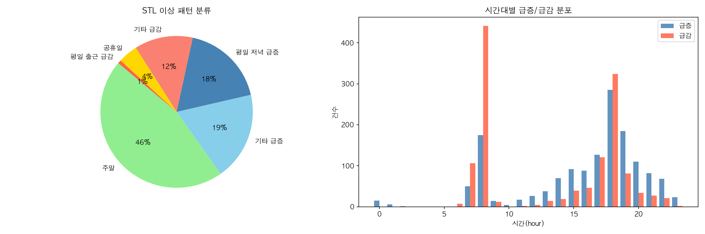
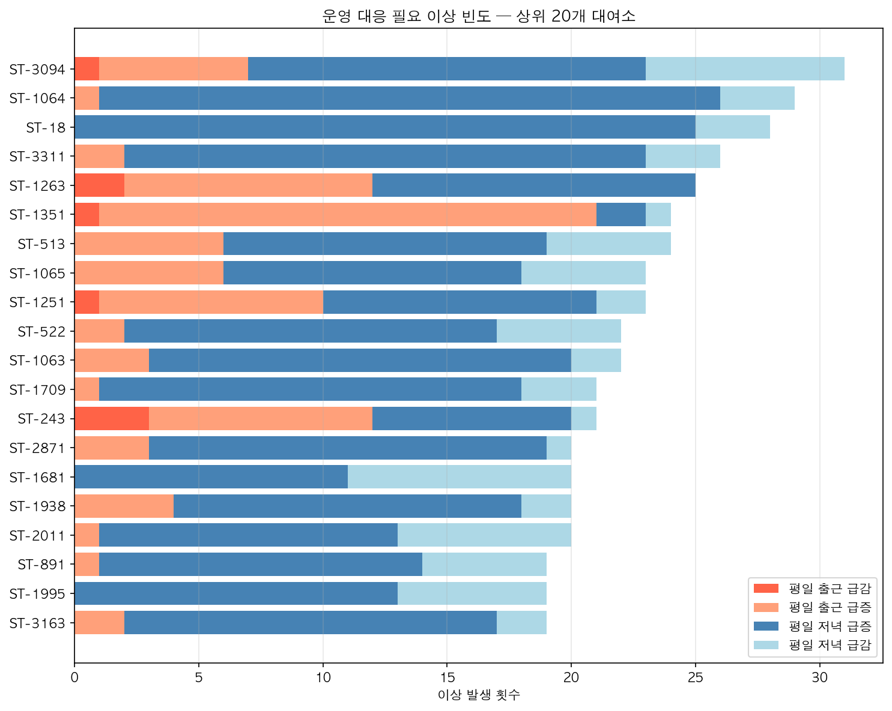
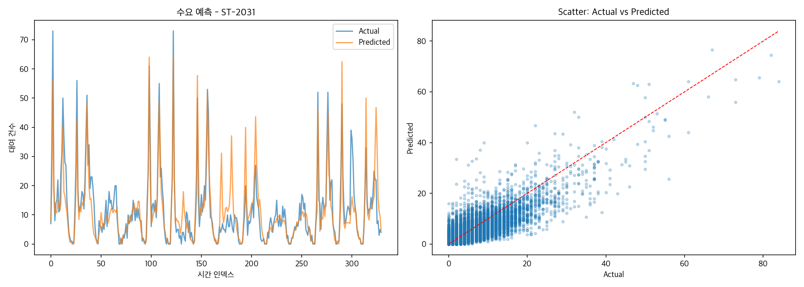

# 따릉이 재배치 지원 ML 프로젝트

## 1. 프로젝트
**개요:** 서울시 따릉이 2025년 4분기 대여 기록 **855만 건**을 분석해 자전거 재배치 의사결정을 자동화합니다. 이용자 유형을 파악하고, 수요 급증 패턴을 감지하고, 시간별 수요를 예측하는 3단계 ML 파이프라인으로 구성됩니다.

**결론:** 수요의 87%가 평일 단거리 통근에 집중되고, 17~19시 급증은 매주 같은 패턴으로 반복됩니다. 반복 패턴은 규칙으로 자동화하고, 나머지 수요는 LightGBM 예측(오차 1.7건)으로 전날 밤 재배치 계획을 미리 생성합니다. 단, 피크 시간대는 모델이 과소 예측하는 경향이 있어 반복 급증 패턴 탐지와 병행해 안전 마진을 적용합니다. 결과적으로 담당자 판단 없이도 피크 시간 전 적재적소에 자전거를 배치할 수 있습니다.

---

## 2. ML 분석 및 전략 제안

### 2-1. 이용자 유형 — 누가 언제 쓰는가

* **목표:** 이용자의 행동 패턴 파악
* **분석:** K-Means (K=3, 피처: 이용시간·이동거리·속도·시간대) 
* **결과:**

| 유형 | 비율 | 평균 이용시간 | 평균 거리 | 주로 언제 |
|---|---|---|---|---|
| 짧은 저녁형 | 35.3% | 약 10분 | 약 1.7km | 평일 07~09시 |
| 짧은 오전형 | 51.5% | 약 12분 | 약 1.5km | 평일 17~19시 |
| 장거리·여가형 | 13.2% | 약 60분 | 약 5km | 오후~저녁 (주말 포함) |

**86.8%가 평일 단거리**로, 출근(07-09시)과 퇴근(17-19시) 두 피크로 명확히 구분됩니다.
군집 결과를 EDA(시간대별 대여 건수, 요일×시간 히트맵)와 대조하면 실제 이용 패턴과 일치합니다.

* **제안:**  
**짧은 저녁형:** 출근 피크(07~09시) 전 주거지·환승역 대여소 사전 재고 충전  
**짧은 오전형:** 17시 이전 업무지구·환승역 대여소 재고 확보 (저녁 급증 사전 대응)  
**장거리·여가형:** 장거리·주말 수요 대여소 별도 운영 기준 적용
  

### 2-2. 수요 급증 패턴 — 언제 어디서 반복되는가

* **목표:** 언제, 어느 대여소에서 수요가 갑자기 증가·감소하는지 감지
* **분석:** STL 분해 (24시간 계절성 제거 후 잔차 기반 감지, 8개 패턴 분류)
* **결과:**

상위 50개 대여소에서 탐지된 이상 패턴 **2,776건**.

| 패턴 | 비율 | 해석 |
|---|---|---|
| 주말 | 46% | 구조적 수요 차이 — 이상 알림 제외, 별도 운영 기준 적용 |
| **평일 저녁 급증 (17~19시)** | **18%** | 매주 반복 — 사전 재배치 규칙으로 자동화 가능 |
| 기타 급증 | 13% | 이벤트·날씨 영향 가능성 |
| 평일 저녁 급감 (17~19시) | 6% | 퇴근 시간 자전거 고갈 — 즉시 대응 필요 |
| 평일 출근 급증 (08시) | 6% | 반납 집중으로 거치대 포화 가능성 |
| 기타 급감 | 6% | 일시적 수요 위축 |
| 공휴일 | 4% | 공휴일 특수 수요 |
| 평일 출근 급감 (08시) | 1% | 출근 시간 자전거 고갈 |

저녁 시간대(17~19시) 관련 이상을 합산하면 전체의 **24%** 로, 운영 대응 우선순위가 가장 높다.
두 번째 그래프는 출근·저녁 이상이 반복적으로 발생하는 대여소를 보여준다.

* **제안:**  
**17시 이전 사전 재배치:** 저녁 이상 반복 대여소 우선 재고 확충  
**야간 재배치:** 출근 이상 반복 대여소 전날 밤 자전거 사전 배치  
**주말·공휴일 분리:** 이상 알림에서 제외하고 별도 운영 기준 적용
  
  
### 2-3. 시간별 수요 예측 — 얼마나 정확하게 알 수 있는가

* **목표:** 시간별 수요 예측
* **분석:** LightGBM
* **결과:**

| 추가한 정보 | 예측 오차 | 개선 |
|---|---|---|
| 전체 평균만 (기준) | 4.063건 | — |
| + 대여소·시간·요일 | 2.167건 | **47% 감소** |
| + 전날·전주 이용량 | 1.804건 | 추가 17% 감소 |
| **+ 유입/유출 흐름** | **1.737건** | **★ 최종 모델** |
| + 시간을 수학 변환 | 1.738건 | 개선 없음 — 제거 근거 |

평균 베이스라인(4.1건) 대비 오차를 **57% 감소**시켰으며, 주기적 피크·야간 저수요 등 전반적인 패턴을 잘 포착한다. 피크 급증 구간의 과소 예측은 2-2의 반복 급증 패턴 탐지로 보완한다.

* **제안:**  
**예측 + 패턴 이중 보완:** LightGBM이 과소 예측하는 피크 시간대는 2-2의 반복 급증 패턴을 함께 활용해 안전 마진 적용  
**출근 피크 자동화:** 전날 밤 07-09시 고갈 예상 대여소 목록 자동 생성  
**재배치 동선 최적화:** 예측 수요 + 주변 여유분으로 공급원 자동 추천, 트럭 동선 사전 계획.
