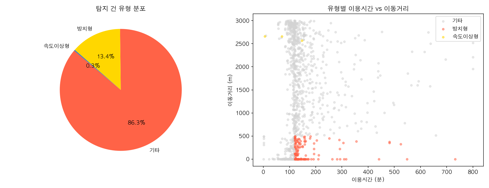
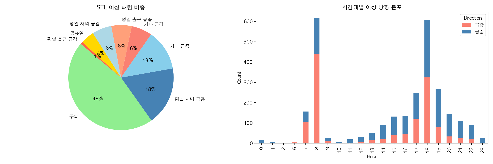
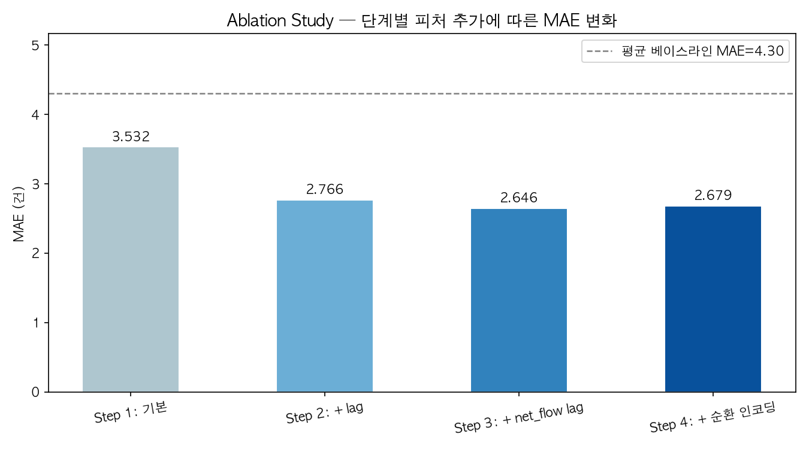
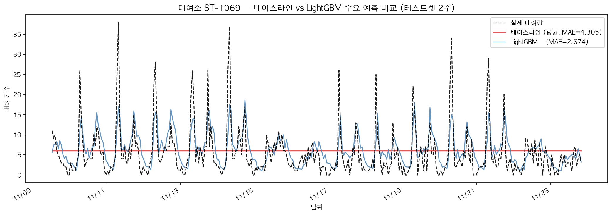
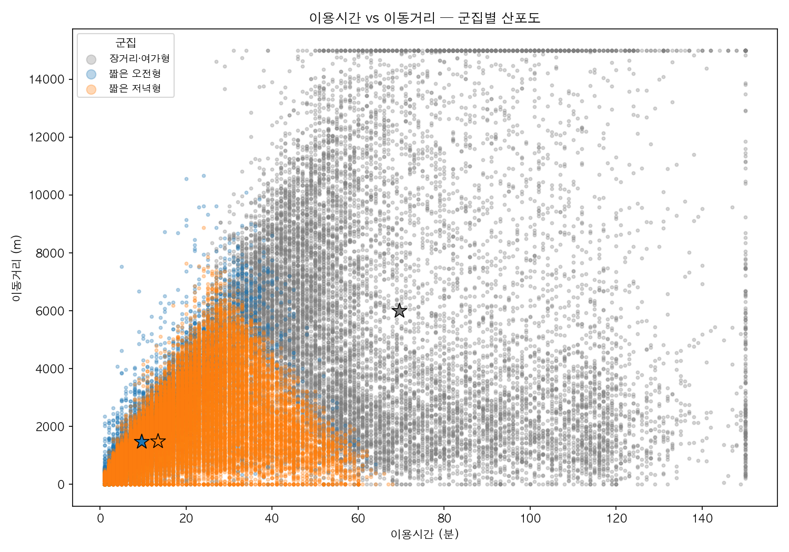
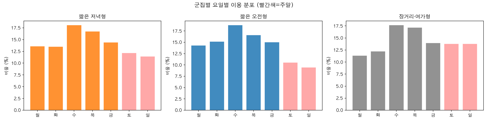

# 서울시 공공자전거 따릉이 데이터 분석 & ML 프로젝트

서울시 따릉이 2025년 10~12월 대여 데이터(약 856만 건)를 활용한 머신러닝 프로젝트입니다.

---

## 데이터

| 항목 | 내용 |
|---|---|
| 출처 | 서울 열린데이터광장 (공공자전거 이용정보) |
| 기간 | 2025년 10월 ~ 12월 (3개월) |
| 규모 | **8,559,939건** 대여 기록 |
| 주요 컬럼 | 대여/반납 일시, 대여소 ID/명, 이용시간, 이용거리, 성별, 생년, 자전거 종류 |

---

## 프로젝트 요약

### 01. 이상치 탐지 (Anomaly Detection)

**목표**: 비정상 이용 패턴 및 수요 급변 시점 탐지

**방법**: Isolation Forest + LOF (개별 건), STL 분해 (시계열)

---

#### 1-1. Isolation Forest / LOF — 개별 건 이상치 탐지

| 방법 | 탐지 건수 | contamination |
|---|---|---|
| Isolation Forest | 4,000건 | 2% |
| LOF | 400건 | 2% |

**가설 검증**: IF가 방치 건(오래 빌리고 짧게 이동)을 탐지할 것으로 기대했으나, 실제 탐지 건을 분류한 결과는 다음과 같음.

| 유형 | 건수 | 비율 | 설명 |
|---|---|---|---|
| 장거리형 (use_m > 10km) | 2,953건 | **73.8%** | 통계적으로 드문 장거리 정상 이용 |
| 기타 | 992건 | 24.8% | 중거리 장시간 |
| 방치형 (120분+, 500m 미만) | 37건 | 0.9% | 실제 방치 의심 |
| 속도이상형 (30km/h+) | 18건 | 0.4% | GPS 오류 의심 |



> **결론**: IF는 "방치 탐지기"가 아닌 "통계적 희소성 탐지기"로 작동했음. 장거리 이용(평균 이동거리 13km)이 드문 패턴이기 때문에 이상치로 판정된 것.

**룰 기반 방치 건 직접 탐색** (`use_min_calc > 360분` AND `use_m < 500m`):
- 탐지 건수: **248건 (0.003%)** — 856만 건 중 극소수
- 방치 건의 18~23시 비율: **4.0%** (정상 건 29.9%) → 야간 집중 가설 불성립, 오히려 낮 시간 집중
- GPS 오류 의심 (10km+ 이용 중 속도 30km/h+): **315건 (0.2%)**

---

#### 1-2. STL 시계열 이상치 탐지

상위 대여소 1개의 시간별 수요에 STL 분해를 적용해 잔차 기반 이상치를 탐지했습니다.

**탐지 결과**: **58개 이상 시간대** (급감 43건 / 급증 15건)

| 패턴 | 건수 | 주요 시간대 |
|---|---|---|
| 주말 수요 이상 | 37건 | 평일과 구조적으로 다른 주말 수요 패턴 |
| 평일 출근 급감 | 19건 | **08시** 집중 (한파·악천후 추정) |
| 평일 저녁 급증 | 11건 | **17~19시** 집중 (레저·이벤트) |
| 공휴일 | 2건 | 개천절, 한글날 |




**비즈니스 인사이트 A: 날씨·요일 기반 운영 캘린더**

STL 이상치 패턴에서 두 가지 운영 룰을 도출할 수 있습니다.

- **08시 급감 (19건)**: 악천후·한파 예보가 있는 날의 출근 수요는 완전히 소멸. 해당일 출근 대여소 재배치 트럭 파견 불필요 → 기상청 API 연동으로 전날 저녁 재배치 계획 자동 취소 가능
- **17~19시 급증 (11건)**: 특정 저녁 퇴근 수요 폭증 → 주요 환승역 인근 대여소 사전 재고 확충 필요

---

#### 1-3. 장거리 이용 → 대여소 자전거 유출 경로 분석

IF 탐지 건이 장거리 정상 이용이었다는 발견을 바탕으로, 10km+ 이용 **202,658건**의 출발·도착 대여소를 추적했습니다.

| 구분 | 대표 대여소 | 순유출/유입 |
|---|---|---|
| **순유출 TOP** | 롯데월드타워(잠실역), NH농협은행 앞, 포스코사거리 | 최대 **+246건** |
| **순유입 TOP** | 한강버스 망원·뚝섬·잠실 선착장, 청계천, 당산 | 최대 **-559건** |

> **패턴**: 도심·강남권 대여소 출발 → 한강변·수변 대여소 종착. 오후 레저 이용(14~18시 집중)이 대여소 불균형의 구조적 원인.


**비즈니스 인사이트 B: 재배치 트럭 운영 방향**

재배치 트럭은 **한강변 → 도심 방향**으로 운영. 오후 레저 수요 종료 후(18시+) 한강변 대여소에서 회수 → 다음날 아침 도심 대여소에 공급하는 사이클 수립으로 구조적 불균형 해소 가능.

- 순유출 양의 대여소: **1,524개** / 순유입 양의 대여소: **1,178개**
- 전체 장거리 이용 순유출 합계: **29,998건**

---

### 02. 시간별 대여 수요 예측 (Demand Forecasting)

**목표**: 각 대여소의 다음 1시간 대여 건수 예측

**모델**: LightGBM (MAE 최소화 목적, L1 loss)

**데이터**: 상위 100개 대여소 × 시간별 집계, 학습 4,868건 / 테스트 1,623건

---

#### 2-1. Ablation Study — 단계별 피처 추가

동일한 모델 구조(LightGBM, early stopping)에서 피처 셋만 바꿔 MAE 변화를 측정했습니다.

| 단계 | 피처 구성 | 피처 수 | MAE | 개선율 |
|---|---|---|---|---|
| 평균 베이스라인 | 학습 데이터 전체 평균 | — | 4.305건 | — |
| Step 1 | 대여소, 시간, 요일, 월, 주말, 공휴일 | 8 | 3.532건 | 기본 LightGBM |
| Step 2 | Step 1 + lag 피처 (1h~720h, rolling mean) | 19 | 2.766건 | **-21.7%** |
| Step 3 | Step 2 + net_flow lag (1h, 24h, 168h) | 22 | **2.646건** | **-4.3%** |
| Step 4 | Step 3 + 순환 인코딩 (sin/cos) | 26 | 2.679건 | +1.2% (악화) |



> **해석**:
> - lag 피처가 단일 최대 기여(21.7%) — 직전 같은 시간대 대여량이 가장 강력한 예측 신호
> - 순환 인코딩은 오히려 소폭 악화 — LightGBM이 hour/dow 정수값을 이미 충분히 학습하기 때문
> - **최종 모델: Step 3** (MAE 2.646, 평균 베이스라인 대비 **38.5% 개선**)




---

#### 2-2. 비즈니스 인사이트: 자전거 고갈 대여소 사전 대응

수요 예측 모델을 활용해 **각 대여소의 자전거 보유량이 0이 되는 시점**을 사전에 예측할 수 있습니다.

- 예측 수요와 현재 보유 대수를 비교해 "고갈 예상 시점"을 N시간 전에 식별
- 고갈 예상 대여소 주변 대여소의 여유분·예측 수요를 동시에 분석해 **공급원 자동 추천**

→ 출근 피크(07~09시) 전날 22시에 다음날 고갈 예상 대여소 목록 자동 생성 → 재배치 트럭 동선 사전 최적화

---

### 03. 사용자 클러스터링 (User Clustering)

**목표**: 이용 패턴 기반 사용자 그룹 분류

**모델**: K-Means (최적 k=3, Silhouette Score 0.274 기준)

**피처**: 이용시간, 이동거리, 속도, 시간대, 요일, 주말 여부, 성별, 나이

> **주의사항**: 자전거 종류(bike_type) 피처 포함 시 전기자전거 여부만으로 클러스터가 분리되는 현상 발견 → 제거 후 행태 기반 의미있는 분리 성공

---

#### 3-1. 군집 분류 결과

| 클러스터 | 비율 | 평균 이용시간 | 평균 거리 | 평균 속도 | 주말 비중 |
|---|---|---|---|---|---|
| **장거리형** | 11% (11,480건) | 73분 | 6.5km | 6.4km/h | 15.1% |
| **레저형** | 21% (21,154건) | 16분 | 1.8km | 8.2km/h | **100%** |
| **단거리 평일형** | 67% (67,366건) | 12분 | 1.5km | 8.8km/h | **0%** |

---



#### 3-2. 시간대·요일 분포 (실측)

**24시간 이용 패턴**:
- **단거리 평일형**: 08시 피크 (출근) + 18시 보조 피크 → 쌍봉 패턴
- **레저형**: 16시 피크 (오후 레저) → 14~17시 완만한 단봉 패턴
- **장거리형**: 18시 피크 (퇴근 후 운동·투어) → 16~18시 저녁 집중




**주말 비중 (전체 평균 22.9% 대비)**:
- 레저형: **100%** (4.37배) — 완전 주말 전용
- 단거리 평일형: **0%** (0배) — 완전 평일 전용
- 장거리형: 15.1% (0.66배) — 평일 집중 (퇴근 후 운동족)

---

#### 3-3. 비즈니스 인사이트: 군집별 맞춤 운영 전략

- **단거리 평일형 (67%)**: 출퇴근 핵심 수요층. 08시·18시 피크 시간대 주요 환승역 인근 대여소 보유 대수 확보가 핵심. 월정액 통근 요금제 주요 타겟
- **레저형 (21%)**: 주말 100% 집중, 14~17시 피크. 공원·한강변 인근 대여소 주말 사전 재고 확충 필수. 주말 이벤트·할인 프로모션 타겟
- **장거리형 (11%)**: 평일 저녁 18시 피크, 주말 비중 전체 평균보다 낮음 → "퇴근 후 운동·투어족"으로 해석. 장거리 코스 안내, 투어 패키지 마케팅 타겟

---

## 기술 스택

| 분류 | 도구 |
|---|---|
| 언어 | Python 3.14 |
| 데이터 처리 | pandas, numpy, pyarrow |
| 머신러닝 | scikit-learn, LightGBM |
| 시계열 분해 | statsmodels (STL) |
| 시각화 | matplotlib, seaborn |
| 개발 환경 | JupyterLab |

---

## 실행 방법

```bash
# 가상환경 설정
python -m venv .venv
source .venv/bin/activate
pip install -r requirements.txt

# 노트북 실행 (순서대로)
jupyter lab
# 00_EDA.ipynb → 01_anomaly_detection.ipynb → 02_demand_forecasting.ipynb → 03_user_clustering.ipynb
```
