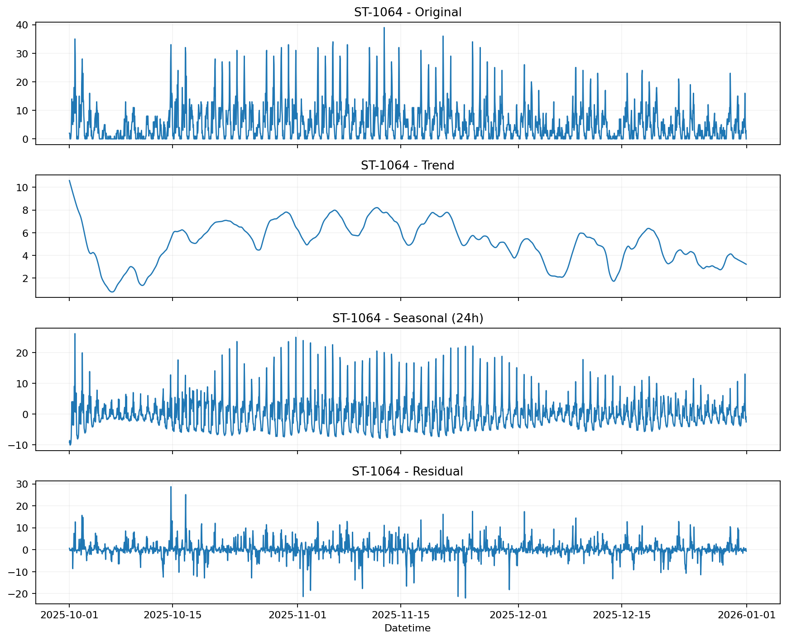

# 서울시 공공자전거 따릉이 데이터 분석 & ML 프로젝트

따릉이 운영의 핵심 문제는 **수요 불균형**입니다. 특정 대여소에서는 자전거가 고갈되고, 다른 대여소에는 쌓입니다. 재배치 트럭은 하루에 수백 번 이동하지만, 어디로 먼저 가야 할지 데이터 기반 기준이 없으면 항상 뒤늦은 대응이 됩니다.

이 프로젝트는 2025년 Q4 대여 데이터 **8,559,939건**으로 세 가지 질문에 답합니다.

> **누가** 이용하는가 → **언제·어디서** 수요 급증이 반복되는가 → **얼마나** 필요한지 미리 예측할 수 있는가

세 분석을 연결하면 "언제, 어디서, 누구를 위해" 재배치할지를 데이터로 결정할 수 있습니다.

---

## 데이터

| 항목 | 내용 |
|---|---|
| 출처 | 서울 열린데이터광장 (공공자전거 이용정보) |
| 기간 | 2025년 10월 1일 ~ 12월 31일 (92일) |
| 규모 | **8,559,939건** |
| 주요 컬럼 | 대여/반납 일시, 대여소 ID·명, 이용시간, 이용거리, 성별, 생년, 자전거 종류 |

---

## 분석 구성

| 분석 | 핵심 질문 | 핵심 결과 |
|---|---|---|
| 01. 사용자 클러스터링 | 이용 패턴이 다른 사용자 그룹은 어떻게 구분되는가? | 3개 그룹: 저녁/오전 단거리형 + 장거리형 |
| 02. 대여소 수요 이상 탐지 | 운영에 실제 영향을 주는 비정상 패턴이 언제, 어디서 발생하는가? | 2,776건 탐지, 평일 17~19시 급증이 반복 패턴 |
| 03. 수요 예측 | 다음 1시간 대여 건수를 예측해 재배치 계획을 자동화할 수 있는가? | MAE 1.698 (베이스라인 대비 55.9% 개선) |

---

## 01. 사용자 클러스터링 (User Clustering)

재배치 전략을 세우려면 먼저 **누가 어떤 패턴으로 이용하는지** 이해해야 합니다. 단순히 많이 쓰는 시간대를 아는 것과, 어떤 목적의 사용자가 언제 몰리는지 아는 것은 대응 방식이 다릅니다.

**모델**: K-Means k=3 | **피처**: `log(이용시간)`, `log(이동거리)`, 시간대·요일 sin/cos

---

### 1-1. 군집 분류 결과

| 클러스터 | 비율 | 평균 이용시간 | 평균 거리 | 평균 속도 | 핵심 특징 |
|---|---|---|---|---|---|
| **짧은 저녁형** | 37.4% (18,676건) | 9.2분 | 1.18km | 8.7km/h | 17~18시 이용 집중 |
| **짧은 오전형** | 32.9% (16,428건) | 8.3분 | 1.13km | 9.2km/h | 09시 전후 이용 집중 |
| **장거리형** | 29.8% (14,896건) | 46.1분 | 4.44km | 6.9km/h | 오후 시간대 장거리 이동 |

결과는 단순히 "주말 vs 평일"로 나뉘지 않았습니다. **단거리 정기 이동형**이 오전·저녁 시간대에 따라 두 세그먼트로 분리되고, **장거리 여가형**이 별도로 형성됐습니다. 이는 재배치 전략을 시간대별로 달리 가져가야 함을 의미합니다.


---

### 1-2. 시간대·요일 패턴

| 클러스터 | 피크 시간대 | 패턴 |
|---|---|---|
| 짧은 저녁형 | 17~18시 | 퇴근 시간대 단거리 이용 집중 |
| 짧은 오전형 | 08~10시 | 출근·통학 시간대 단거리 이용 집중 |
| 장거리형 | 14~18시 | 오후 장거리·여가성 이동 |


단거리 두 군집은 평일 위주인 반면, 장거리형은 주말에도 비중이 유지돼 여가성 이동임을 뒷받침합니다.


---

### 1-3. 모델 선택 근거: K-Means vs GMM 비교

K-Means와 GMM을 k=2~6 범위에서 Silhouette, Calinski-Harabasz, Davies-Bouldin, Stability ARI 4개 지표로 비교했습니다. 두 모델 모두 k=3에서 수렴하며 선택의 일관성을 입증합니다. Silhouette Score 0.185는 낮지만, 이는 이용시간·거리가 연속 분포를 가져 군집 경계가 본질적으로 모호하기 때문입니다. Stability ARI 0.999는 군집 구조 자체는 매우 안정적임을 의미합니다.

> **피처 실험**: 초기에는 `is_weekend`와 `bike_type`이 군집 분리를 과도하게 주도했습니다. 두 변수를 제외하고 시간·요일을 주기형 인코딩으로 바꾸자 실제 이용 행태 중심의 군집이 형성됐습니다.


---

### 1-4. 운영 제안

- **짧은 저녁형 (37.4%)**: 환승역·업무지구 인근 대여소의 17시 이전 재고 확보
- **짧은 오전형 (32.9%)**: 주거지·학군 인근 대여소의 08~10시 운영 안정화
- **장거리형 (29.8%)**: 공원·수변 주변 오후 공급 유지, 여가 프로모션 타겟

---

## 02. 대여소 수요 이상 탐지 (Demand Anomaly Detection)

사용자 패턴을 파악했다면, 다음 질문은 **그 수요가 언제·어디서 예상을 벗어나는가**입니다. 매번 발생하는 급증을 매번 사후 대응하는 대신, 반복되는 패턴을 미리 식별해 대응 규칙으로 전환하는 것이 목표입니다.

**모델**: STL (Seasonal-Trend decomposition using LOESS, `period=24`, `robust=True`) | **데이터**: 상위 50개 대여소 × 시간별 대여량

---

### 2-1. 방법 선택 근거: STL vs Z-score vs IQR

STL을 선택하기 전에 더 단순한 두 가지 방법과 비교했습니다. Z-score와 IQR은 전체 시계열의 통계로 이상을 판단하므로, 매일 반복되는 출근 피크(07~09시)를 이상으로 오탐합니다. STL은 일별 계절성을 먼저 제거한 뒤 잔차에서만 이상을 탐지하므로 구조적 패턴과 실제 이상을 구분할 수 있습니다.


---

### 2-2. STL 기반 수요 이상 탐지 결과

상위 50개 대여소의 시간대별 대여량에 STL을 적용해 추세와 계절성을 제거한 뒤, 잔차가 `3σ`를 초과하는 시점을 이상으로 정의했습니다. 이때 `period=24` 설정은 **하루 주기 계절성**을 분리하므로, 주말처럼 **주간 구조 차이**는 잔차에 일부 남을 수 있어 후처리 단계에서 별도 패턴으로 해석했습니다.

아래 예시는 실제 우선 대응 후보 중 하나인 `ST-1064`에 대해, STL이 원본 시계열을 `추세`, `계절성`, `잔차`로 어떻게 분해하는지 보여줍니다.



**탐지 결과: 2,776건 / 50개 대여소**

| 패턴 | 건수 | 비율 | 해석 |
|---|---|---|---|
| 주말 | 1,275건 | 45.9% | 이상치가 아닌 구조적 수요 차이 |
| 기타 급증 | 522건 | 18.8% | 이벤트·날씨 영향 가능 |
| **평일 저녁 급증 (17~19시)** | **499건** | **18.0%** | 운영 대응 가치가 가장 큰 반복 패턴 |
| 기타 급감 | 344건 | 12.4% | 일시적 수요 위축 |
| 공휴일 | 116건 | 4.2% | 공휴일 특수 수요 반영 |
| 평일 출근 급감 (08시) | 20건 | 0.7% | 건수 적어 단독 규칙화는 어려움 |

주말 비중이 가장 크지만, 이는 실제 이상이라기보다 평일과 다른 구조적 패턴으로 해석하는 것이 적절합니다. 반면 **평일 17~19시 급증**은 비중도 크고 시간대가 명확해, 운영 대응 규칙으로 전환하기 가장 좋은 반복 패턴이었습니다.

아래 첫 번째 그림은 `무슨 이상이 많았는지`와 `언제 집중됐는지`를 함께 보여줍니다. 두 번째 그림은 그중에서도 실제 운영 대응 가치가 큰 **평일 17~19시 급증이 어느 대여소에 반복되는지**를 보여줍니다.


---

### 2-3. 운영 제안

이상 탐지의 목적은 단순히 많이 잡는 것이 아니라, **반복되는 패턴을 운영 규칙으로 전환**하는 것입니다. 평일 저녁 급증이 반복적으로 발생한 `ST-18`, `ST-1064`, `ST-3311` 등은 사전 재고 확충 대상으로 목록화할 수 있습니다.

- **17시 이전 사전 재배치**: 저녁 급증 반복 대여소 중심으로 재고 확충
- **주말·공휴일 분리 대응**: 구조적 패턴이므로 이상 알림이 아닌 별도 운영 규칙으로 관리

이제 "반복되는 곳은 파악됐다". 다음 질문은 **내일 몇 대가 필요한지 수치로 예측할 수 있는가**입니다.

---

## 03. 수요 예측 (Demand Forecasting)

이상 탐지가 "반복되는 문제 대여소"를 식별했다면, 수요 예측은 **내일 몇 대가 필요한지를 사전에 계산**해 재배치를 자동화하는 단계입니다. 클러스터링에서 발견한 시간대별 수요 패턴이 lag 피처로 직접 활용됩니다.

**모델**: LightGBM (L1 loss) | **평가**: 시간 순서 기반 train/test 분할 (`과거 → 미래` 구조), 상위 100개 대여소 × 시간별 집계 132,000행

---

### 3-1. Ablation Study — 피처 기여도 검증

동일한 모델 구조에서 피처 셋만 단계적으로 추가해 각 피처 그룹의 기여도를 측정했습니다. 모든 대여소에 대해 **같은 시점 이전은 학습, 이후는 테스트**가 되도록 구성해 실제 운영 시나리오와 같은 `과거 → 미래` 평가 구조를 따릅니다.

| 단계 | 피처 구성 | 피처 수 | MAE | 개선율 |
|---|---|---|---|---|
| 평균 베이스라인 | 학습 전체 평균 | — | 3.851건 | 기준 |
| Step 1 | 대여소, 시간, 요일, 월, 주말, 공휴일 | 8 | 2.069건 | **-46.3%** |
| Step 2 | Step 1 + lag (1h~720h, rolling mean) | 19 | 1.748건 | **-15.5%** |
| Step 3 | Step 2 + net_flow lag (1h, 24h, 168h) | 22 | **1.698건** | **-2.9%** |
| Step 4 | Step 3 + 순환 인코딩 (sin/cos) | 26 | 1.701건 | +0.2% (악화) |

- **기본 피처만으로 46.3% 개선 (Step 1)**: 시간·요일·대여소 정보가 이미 강력한 신호
- **lag 피처 추가로 추가 15.5% 개선 (Step 2)**: 직전/전일/전주 수요가 결정적 예측 신호
- **순환 인코딩은 오히려 소폭 악화**: LightGBM이 hour/dow 정수값을 이미 충분히 활용하기 때문
- **최종 모델: Step 3** (MAE 1.698, 평균 베이스라인 대비 **55.9% 개선**)


아래는 최종 모델(Step 3)이 실제 수요를 얼마나 잘 추적하는지 보여줍니다. 왼쪽은 시계열, 오른쪽은 예측-실제 산포도입니다.


테스트 구간 2주를 기준으로 베이스라인(단순 평균)과 직접 비교하면 성능 개선 폭이 뚜렷하게 나타납니다.


---

### 3-2. 오차 분석 (Error Analysis)

MAE 1.698이 시간대·대여소별로 어떻게 분포하는지 분석합니다.


- **시간대별**: 출근(07~09시)·퇴근(17~19시) 피크에서 MAE가 높음. 급격한 수요 변화는 lag 피처만으로 완전히 포착되지 않으며, 날씨·이벤트 정보가 추가 개선 여지를 제공
- **대여소별**: 변동성이 큰 환승역·업무지구 인근에서 MAE가 높고, 안정적인 주거지형 대여소에서 낮음
- **잔차 분포**: 0 근처 집중 + 대칭 구조 → 체계적 편향 없음

---

### 3-3. 운영 제안: 고갈 예상 대여소 사전 대응

수요 예측값과 현재 보유 대수를 비교하면 자전거 고갈이 예상되는 대여소와 시점을 사전에 식별할 수 있습니다.

- 출근 피크(07~09시) 전날 22시에 고갈 예상 대여소 목록 자동 생성
- 주변 대여소의 여유분·예측 수요를 동시에 분석해 공급원 자동 추천 → 재배치 트럭 동선 사전 최적화

---

## 종합

| 분석 | 역할 | 산출물 |
|---|---|---|
| 사용자 클러스터링 | 누구를 위한 재배치인가? | 시간대별 수요 세그먼트 3개 |
| 이상 탐지 | 어디가 반복적으로 문제인가? | 우선 대응 대여소 목록 |
| 수요 예측 | 내일 몇 대가 필요한가? | 시간별 수요 예측값 (MAE 1.698) |

세 결과를 연결하면 재배치 의사결정의 전 과정을 자동화할 수 있습니다. 출근 전날 22시에 "내일 07~09시 고갈 예상 대여소 + 해당 대여소를 주로 쓰는 세그먼트 + 공급 가능한 주변 대여소"를 한 번에 계산해 트럭 동선을 사전에 짜는 것이 최종 목표입니다.

---

## 기술 스택

| 분류 | 도구 |
|---|---|
| 언어 | Python 3.14 |
| 데이터 처리 | pandas, numpy, pyarrow |
| 머신러닝 | scikit-learn, LightGBM |
| 시계열 분해 | statsmodels (STL) |
| 시각화 | matplotlib, seaborn |
| 개발 환경 | JupyterLab |

---

## 실행 방법

```bash
# 1. 데이터 준비
# 서울 열린데이터광장 > 공공자전거 이용정보에서 2025년 10~12월 CSV 다운로드
# → data/raw/ 폴더에 저장

# 2. 환경 설정
python -m venv .venv
source .venv/bin/activate
pip install -r requirements.txt

# 3. 노트북 실행
jupyter lab
# 실행 순서: 00_EDA → 01_user_clustering → 02_anomaly_detection → 03_demand_forecasting
```
