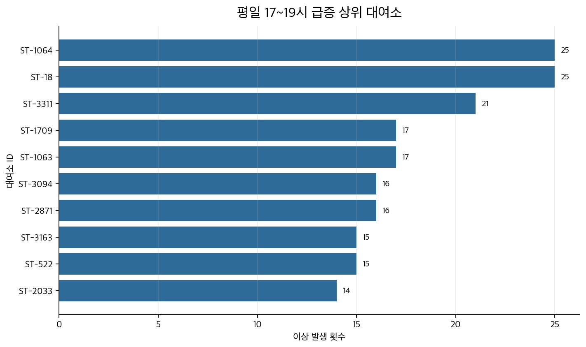

# 서울시 공공자전거 따릉이 데이터 분석 & ML 프로젝트

---

## 데이터

| 항목 | 내용 |
|---|---|
| 출처 | 서울 열린데이터광장 (공공자전거 이용정보) |
| 기간 | 2025년 10월 1일 ~ 12월 31일 (92일) |
| 규모 | 8,559,939건 |
| 주요 컬럼 | 대여/반납 일시, 대여소 ID·명, 이용시간, 이용거리, 성별, 생년, 자전거 종류 |

---

## 01. 사용자 클러스터링 (User Clustering)

**모델**: K-Means k=3 | **피처**: log(이용시간), log(이동거리), 시간대·요일 sin/cos

---

### 1-1. 군집 분류 결과

| 클러스터 | 비율 | 평균 이용시간 | 평균 거리 | 평균 속도 | 특징 |
|---|---|---|---|---|---|
| 짧은 저녁형 | 37.4% (18,676건) | 9.2분 | 1.18km | 8.7km/h | 17~18시 이용 집중 |
| 짧은 오전형 | 32.9% (16,428건) | 8.3분 | 1.13km | 9.2km/h | 09시 전후 이용 집중 |
| 장거리형 | 29.8% (14,896건) | 46.1분 | 4.44km | 6.9km/h | 오후 시간대 장거리 이동 |

---

### 1-2. 시간대·요일 패턴

| 클러스터 | 피크 시간대 | 패턴 |
|---|---|---|
| 짧은 저녁형 | 17~18시 | 퇴근 시간대 단거리 이용 집중 |
| 짧은 오전형 | 08~10시 | 출근·통학 시간대 단거리 이용 집중 |
| 장거리형 | 14~18시 | 오후 장거리·여가성 이동 |

단거리 두 군집은 평일 위주이고, 장거리형은 주말 비중이 유지된다.

---

### 1-3. 운영 제안

- 짧은 저녁형 (37.4%): 환승역·업무지구 인근 대여소의 17시 이전 재고 확보
- 짧은 오전형 (32.9%): 주거지·학군 인근 대여소의 08~10시 운영 안정화
- 장거리형 (29.8%): 공원·수변 주변 오후 공급 유지, 여가 프로모션 타겟

---

## 02. 대여소 수요 이상 탐지 (Demand Anomaly Detection)

**모델**: STL (Seasonal-Trend decomposition using LOESS, period=24, robust=True) | **데이터**: 상위 50개 대여소 × 시간별 대여량

### 2-1. STL 기반 수요 이상 탐지 결과

상위 50개 대여소의 시간대별 대여량에 STL을 적용해 잔차가 `3σ`를 초과하는 시점을 이상으로 정의했다. `period=24`로 하루 주기 계절성을 분리하므로 주간 구조 차이(주말 등)는 잔차에 일부 남아 별도 패턴으로 해석했다.

**탐지 결과: 2,776건 / 50개 대여소**

| 패턴 | 건수 | 비율 | 해석 |
|---|---|---|---|
| 주말 | 1,275건 | 45.9% | 이상치가 아닌 구조적 수요 차이 |
| 기타 급증 | 522건 | 18.8% | 이벤트·날씨 영향 가능 |
| **평일 저녁 급증 (17~19시)** | **499건** | **18.0%** | 운영 규칙으로 전환하기 좋은 반복 패턴 |
| 기타 급감 | 344건 | 12.4% | 일시적 수요 위축 |
| 공휴일 | 116건 | 4.2% | 공휴일 특수 수요 반영 |
| 평일 출근 급감 (08시) | 20건 | 0.7% | 건수 적어 단독 규칙화는 어려움 |

주말(45.9%)은 이상이라기보다 구조적 수요 차이다. 평일 17~19시 급증(18.0%)이 운영 규칙으로 쓰기 가장 좋은 반복 패턴이다.

---

### 2-2. 운영 제안

- 17시 이전 사전 재배치: 저녁 급증 반복 대여소(ST-18, ST-1064, ST-3311 등) 중심으로 재고 확충
- 주말·공휴일 분리 대응: 구조적 패턴이므로 이상 알림이 아닌 별도 운영 규칙으로 관리

---

## 03. 수요 예측 (Demand Forecasting)

**모델**: LightGBM (L1 loss) | **평가**: 시간 순서 기반 train/test 분할 (`과거 → 미래` 구조), 상위 100개 대여소 × 시간별 집계 132,000행

---

### 3-1. Ablation Study — 피처 기여도 검증

피처를 단계적으로 추가하며 기여도를 측정했다. 같은 시점 기준으로 학습/테스트를 분리해 과거→미래 구조를 유지했다.

| 단계 | 피처 구성 | 피처 수 | MAE | 개선율 |
|---|---|---|---|---|
| 평균 베이스라인 | 학습 전체 평균 | — | 3.851건 | 기준 |
| Step 1 | 대여소, 시간, 요일, 월, 주말, 공휴일 | 8 | 2.069건 | -46.3% |
| Step 2 | Step 1 + lag (1h~720h, rolling mean) | 19 | 1.748건 | -15.5% |
| Step 3 | Step 2 + net_flow lag (1h, 24h, 168h) | 22 | **1.698건** | -2.9% |
| Step 4 | Step 3 + 순환 인코딩 (sin/cos) | 26 | 1.701건 | +0.2% (악화) |

- Step 1: 시간·요일·대여소만으로 46.3% 개선. 기본 시계열 구조가 예측의 대부분을 설명한다.
- Step 2: lag 피처 추가로 15.5% 추가 개선. 직전/전일/전주 수요가 다음 시간을 잘 예측한다.
- Step 4: 순환 인코딩 추가 시 소폭 악화. LightGBM은 정수형 시간 피처를 이미 충분히 처리한다.
- 최종 모델: Step 3 (MAE 1.698, 베이스라인 대비 55.9% 개선)

### 3-2. 운영 제안

- 출근 피크(07~09시) 전날 22시에 고갈 예상 대여소 목록 자동 생성
- 주변 대여소의 여유분·예측 수요를 동시에 분석해 공급원 자동 추천 → 재배치 트럭 동선 사전 최적화

---

## 종합

| 분석 | 역할 | 산출물 |
|---|---|---|
| 사용자 클러스터링 | 누구를 위한 재배치인가? | 시간대별 수요 세그먼트 3개 |
| 이상 탐지 | 어디가 반복적으로 문제인가? | 우선 대응 대여소 목록 |
| 수요 예측 | 내일 몇 대가 필요한가? | 시간별 수요 예측값 (MAE 1.698) |
