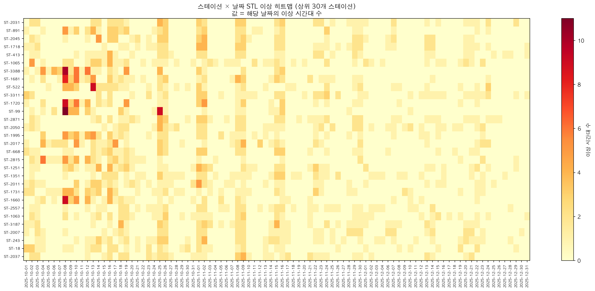
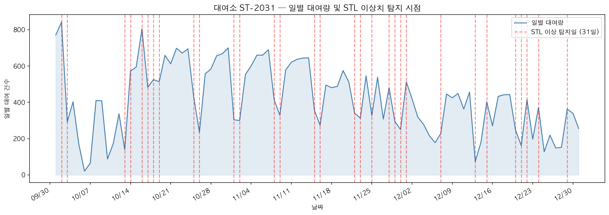
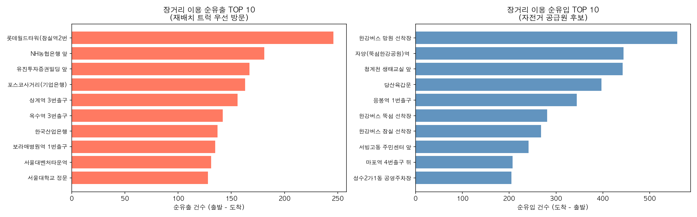
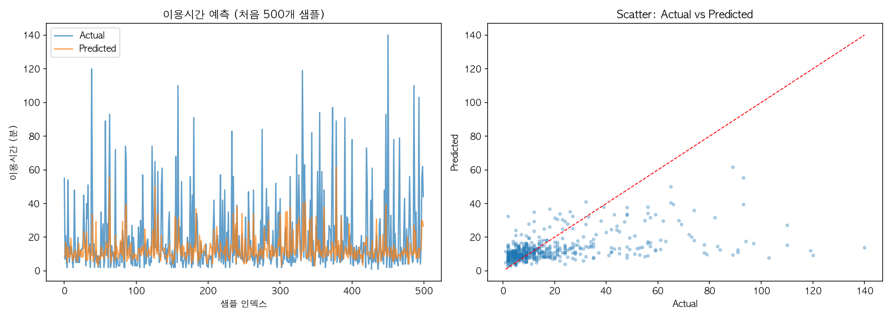
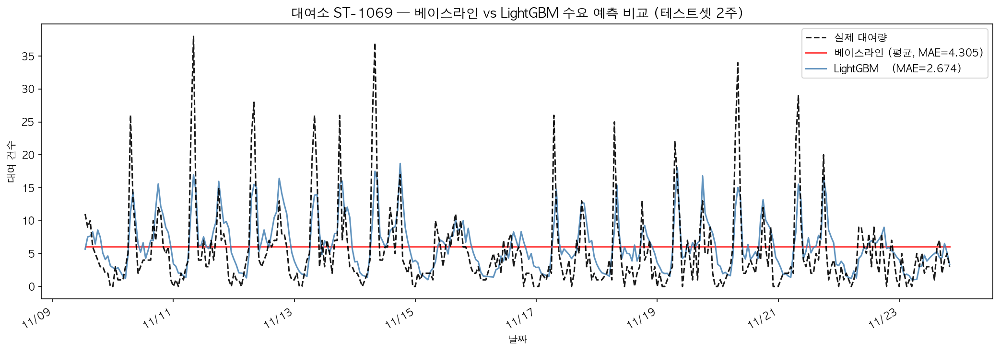
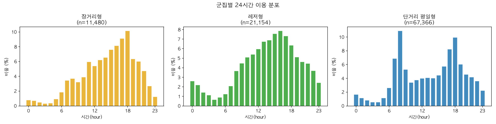

# 서울시 공공자전거 따릉이 데이터 분석 & ML 프로젝트

서울시 따릉이 2025년 10~12월 대여 데이터 **8,559,939건**을 바탕으로 운영 효율화에 직접 활용 가능한 3가지 분석을 수행했습니다.

---

## 데이터

| 항목 | 내용 |
|---|---|
| 출처 | 서울 열린데이터광장 (공공자전거 이용정보) |
| 기간 | 2025년 10월 1일 ~ 12월 31일 (92일) |
| 규모 | **8,559,939건** |
| 주요 컬럼 | 대여/반납 일시, 대여소 ID·명, 이용시간, 이용거리, 성별, 생년, 자전거 종류 |

---

## 분석 구성

| # | 분석 | 핵심 질문 |
|---|---|---|
| 01 | 이상치 탐지 | 운영에 실제 영향을 주는 비정상 패턴이 언제, 어디서 발생하는가? |
| 02 | 수요 예측 | 다음 1시간 대여 건수를 예측해 재배치 계획을 자동화할 수 있는가? |
| 03 | 사용자 클러스터링 | 이용 패턴이 다른 사용자 그룹은 어떻게 구분되는가? |

---

## 01. 이상치 탐지 (Anomaly Detection)

운영 문제를 3가지로 분리하고 각각에 최적화된 방법을 적용했습니다. 단일 ML 모델로 모든 이상을 찾으려 할 경우, 통계적으로 희귀하지만 운영적으로는 정상인 장거리 이용이 결과를 오염시키는 문제가 발생합니다.

| 문제 | 방법 | 결과 요약 |
|---|---|---|
| GPS 오류 | Rule-based | 4,892건 제거 |
| 방치 자전거 | Rule-based + IF | 248건, 하루 평균 2.7건 |
| 수요·공급 불균형 | STL + 유출 분석 | 저녁 급증 패턴 + 하루 326건 구조적 유출 |

---

### 1-1. GPS 오류 — 데이터 품질 정제

`speed_kmh > 35km/h` 기준으로 물리적으로 불가능한 속도를 가진 트립을 제거했습니다.

- **4,892건 (전체의 0.057%)**
- 이후 모든 분석에서 제외 처리

---

### 1-2. 방치 자전거 탐지

**탐지 기준**: `use_min_calc > 360분` AND `use_m < 500m`

`use_min` 대신 `use_min_calc`를 사용한 이유: 시스템이 이용시간을 최대 480분으로 cap 처리하기 때문에 실제 장시간 방치 건이 과소 집계됩니다. 실제 480분 초과 이용은 1,333건이지만 기록상 841건만 480분으로 표시됩니다.

| 지표 | 방치 건 | 정상 건 |
|---|---|---|
| 분기 건수 | 248건 | 8,559,691건 |
| **하루 평균** | **2.7건** | — |
| 건당 평균 점유시간 | **527분 (8.8시간)** | 20.7분 |
| 평균 이동거리 | 164.0m | — |
| 18~23시 비율 | 4.0% | 29.9% |

**가설 불성립**: 방치가 야간에 집중된다는 통념과 달리, 실제 18~23시 비율은 4.0%로 정상 건(29.9%)보다 훨씬 낮습니다. 방치는 낮 시간대·평일에 분산 발생합니다.

**운영 임팩트**: 방치 248건의 총 점유시간은 130,785분. 정상 이용 평균(20.7분)으로 환산하면 **분기 약 6,320건의 대여 기회 손실**에 해당합니다.

**Isolation Forest 보완 탐색**

장거리(> 3km)·GPS 오류 제외 후 단거리 영역(전체 81%)에만 적용, contamination=0.005로 실제 방치율에 근접하게 조정.

- 탐지: 1,000건 (평균 153분, 평균 1,408m)
- 룰 경계 케이스 발굴 목적이며, 방치 여부는 현장 확인 필요

> 기존에 필터 없이 전체 데이터에 IF를 적용했을 때 탐지 건의 73.8%가 장거리 정상 이용으로 분류됐습니다. 장거리는 통계적으로 드물지만 운영적으로는 정상이므로, IF 적용 전 제외하는 것이 핵심입니다.

**운영 제안**
- `use_min_calc > 360분 & use_m < 500m` 조건을 모니터링 시스템 트리거로 연동 (하루 2.7건 수준으로 운영 부담 낮음)
- 현행 `use_min` cap 기준은 실제 방치 건을 약 3분의 1 수준으로 과소계산 → `use_min_calc` 기반 전환 필요

---

### 1-3. 수요 이상 탐지 — STL 분해 (상위 50개 대여소)

대여량 상위 50개 대여소에 STL(Seasonal-Trend decomposition using LOESS)을 적용해 잔차가 3σ를 초과하는 시간대를 이상으로 정의했습니다.

**탐지 결과: 2,776건 / 50개 대여소**

| 패턴 | 건수 | 비율 | 해석 |
|---|---|---|---|
| 주말 | 1,275건 | 46.0% | 이상치가 아닌 구조적 패턴 차이 |
| 기타 급증 | 522건 | 18.8% | 이벤트·날씨 연계 추정 |
| **평일 저녁 급증 (17~19시)** | **499건** | **18.0%** | 레저·퇴근 연계, 사전 대응 가능 |
| 기타 급감 | 344건 | 12.4% | — |
| 공휴일 | 116건 | 4.2% | 개천절, 한글날 등 |
| 평일 출근 급감 (08시) | 20건 | 0.7% | 건수 적어 단독 패턴으로 보기 어려움 |

주말 46.0%는 평일과 수요 구조가 다른 것으로, 이상치가 아닙니다. 실질적으로 운영 대응이 가능한 것은 **평일 17~19시 급증(499건)** — 스테이션당 분기 약 10건, 월 3.3건 발생합니다.

**운영 제안**
- 17~19시 급증이 반복되는 대여소를 식별해 해당일 17시 전 재고 확충 (STL 잔차 기반 전일 탐지 가능)
- 평일 출근 급감(20건)은 50개 스테이션 × 3개월 기준으로 건수가 적어, 기상청 한파 예보와 교차 검증 후 활용 권장





---

### 1-4. 자전거 유출 분석 — 대여소 간 불균형

10km 이상 이용 **202,658건** (GPS 오류 387건 제외 후 실제 장거리 202,271건)의 출발·도착 대여소를 추적해 자전거 순유출 규모를 산출했습니다.

| 구분 | 대여소 | 분기 순유출/유입 |
|---|---|---|
| 순유출 1위 | 롯데월드타워(잠실역2번출구 쪽) | +246건 |
| 순유출 2위 | NH농협은행 앞 | +181건 |
| 순유출 3위 | 유진투자증권빌딩 앞 | +167건 |
| 순유출 4위 | 포스코사거리(기업은행) | +163건 |
| 순유입 1위 | 한강버스 망원 선착장 | -559건 |
| 순유입 2위 | 자양(뚝섬한강공원)역 1번출구 앞 | -444건 |
| 순유입 3위 | 청계천 생태교실 앞 | -442건 |

- 순유출 대여소: **1,524개** / 순유입 대여소: **1,178개**
- 분기 누적 순유출: 29,998건 → **하루 평균 326건**

도심·강남권 대여소에서 출발한 자전거가 한강변·수변 대여소로 유입되는 패턴이 매일 반복됩니다. 임시 대응이 아닌 정기 루트로 고정화가 필요한 규모입니다.

**운영 제안**
- 재배치 방향: **한강변(망원·뚝섬·청계천) → 도심(롯데월드타워·포스코사거리)**을 매일 저녁 정기 운영
- 순유출 상위 대여소는 1,524개 중 단일 최대값 기준으로 재배치 우선순위 목록 고정화



---

## 02. 수요 예측 (Demand Forecasting)

**목표**: 각 대여소의 다음 1시간 대여 건수 예측

**모델**: LightGBM (MAE 최소화, L1 loss)

**데이터**: 상위 100개 대여소 × 시간별 집계, 학습 4,868건 / 테스트 1,623건

---

### 2-1. Ablation Study — 피처 기여도 검증

동일한 모델 구조에서 피처 셋만 단계적으로 추가해 각 피처 그룹의 기여도를 측정했습니다.

| 단계 | 피처 구성 | 피처 수 | MAE | 개선율 |
|---|---|---|---|---|
| 평균 베이스라인 | 학습 전체 평균 | — | 4.305건 | 기준 |
| Step 1 | 대여소, 시간, 요일, 월, 주말, 공휴일 | 8 | 3.532건 | — |
| Step 2 | Step 1 + lag (1h~720h, rolling mean) | 19 | 2.766건 | **-21.7%** |
| Step 3 | Step 2 + net_flow lag (1h, 24h, 168h) | 22 | **2.646건** | **-4.3%** |
| Step 4 | Step 3 + 순환 인코딩 (sin/cos) | 26 | 2.679건 | +1.2% (악화) |

- **lag 피처가 단일 최대 기여(21.7%)**: 직전 같은 시간대 대여량이 가장 강력한 예측 신호
- **순환 인코딩은 오히려 소폭 악화**: LightGBM이 hour/dow 정수값을 이미 충분히 활용하기 때문
- **최종 모델: Step 3** (MAE 2.646, 평균 베이스라인 대비 **38.5% 개선**)






---

### 2-2. 운영 제안: 고갈 예상 대여소 사전 대응

수요 예측값과 현재 보유 대수를 비교하면 자전거 고갈이 예상되는 대여소와 시점을 사전에 식별할 수 있습니다.

- 출근 피크(07~09시) 전날 22시에 고갈 예상 대여소 목록 자동 생성
- 주변 대여소의 여유분·예측 수요를 동시에 분석해 공급원 자동 추천 → 재배치 트럭 동선 사전 최적화

---

## 03. 사용자 클러스터링 (User Clustering)

**목표**: 이용 행태 기반 사용자 그룹 분류

**모델**: K-Means (최적 k=3, Silhouette Score 0.274)

**피처**: 이용시간, 이동거리, 속도, 시간대, 요일, 주말 여부, 성별, 나이

> **교훈**: 자전거 종류(bike_type) 포함 시 전기자전거 여부만으로 클러스터가 분리됨. 행태 기반 분리를 위해 제거 후 재실험.

---

### 3-1. 군집 분류 결과

| 클러스터 | 비율 | 평균 이용시간 | 평균 거리 | 평균 속도 | 주말 비중 |
|---|---|---|---|---|---|
| **단거리 평일형** | **67%** (67,366건) | 12분 | 1.5km | 8.8km/h | **0%** |
| **레저형** | 21% (21,154건) | 16분 | 1.8km | 8.2km/h | **100%** |
| **장거리형** | 11% (11,480건) | 73분 | 6.5km | 6.4km/h | 15.1% |

주말 비중에서 클러스터가 완벽하게 분리됩니다. 레저형은 100% 주말, 단거리 평일형은 0% 주말로 겹치는 이용자가 없습니다.


---

### 3-2. 시간대·요일 패턴

| 클러스터 | 피크 시간대 | 패턴 |
|---|---|---|
| 단거리 평일형 | 08시, 18시 | 출퇴근 쌍봉 패턴 |
| 레저형 | 14~17시 | 오후 단봉 패턴 |
| 장거리형 | 16~18시 | 퇴근 후 저녁 집중 |




---

### 3-3. 운영 제안

- **단거리 평일형 (67%)**: 주요 환승역 인근 대여소의 08시·18시 재고 확보가 핵심. 출퇴근 월정액 요금제 주요 타겟
- **레저형 (21%)**: 주말 한강변·공원 인근 대여소 사전 재고 확충 필요. 주말 이벤트·할인 프로모션 타겟
- **장거리형 (11%)**: 평일 저녁 퇴근 후 운동·투어 이용. 장거리 코스 안내 서비스, 투어 패키지 마케팅 타겟

---

## 기술 스택

| 분류 | 도구 |
|---|---|
| 언어 | Python 3.14 |
| 데이터 처리 | pandas, numpy, pyarrow |
| 머신러닝 | scikit-learn, LightGBM |
| 시계열 분해 | statsmodels (STL) |
| 시각화 | matplotlib |
| 개발 환경 | JupyterLab |

---

## 실행 방법

```bash
python -m venv .venv
source .venv/bin/activate
pip install -r requirements.txt

jupyter lab
# 실행 순서: 00_EDA → 01_anomaly_detection → 02_demand_forecasting → 03_user_clustering
```
